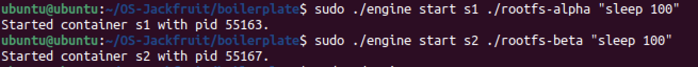
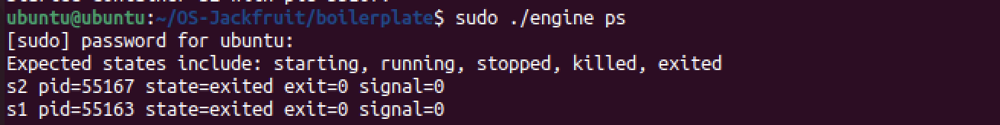
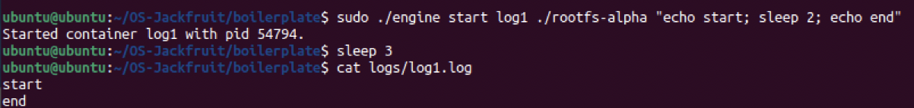
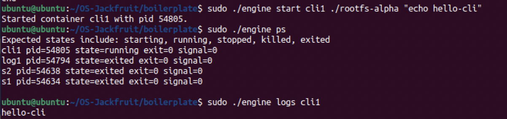
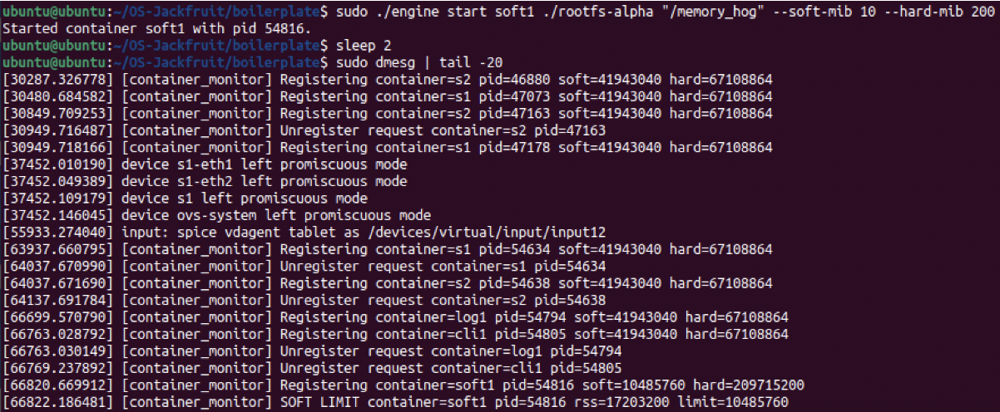
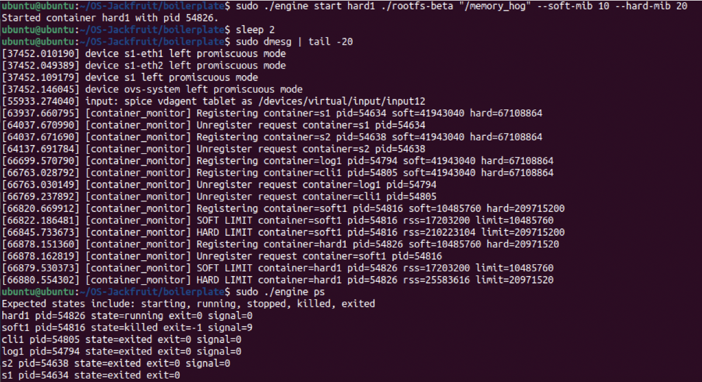
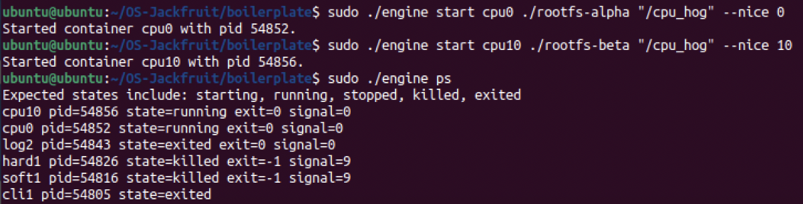
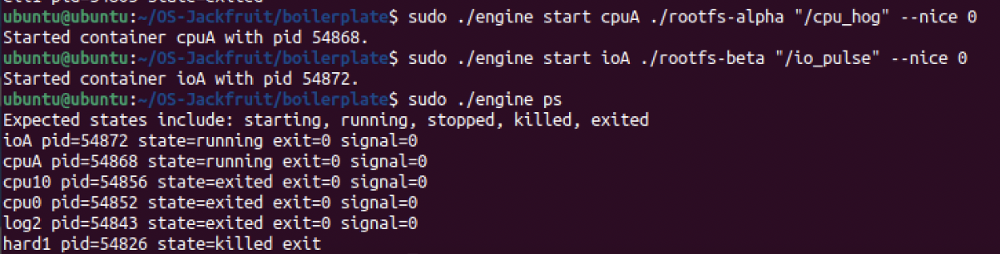
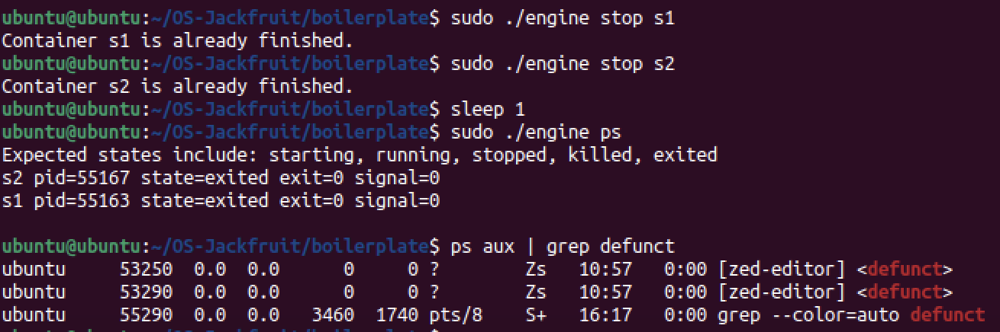

# Multi-Container Runtime (OS Jackfruit)

## 1. Team Information
- Names : Riyana K  & Rhea Menon
- SRN: PES1UG24AM226 & PES1UG24AM222
 

---

## 2. Build, Load, and Run Instructions

### Step 1: Build
```bash
make
```

### Step 2: Load Kernel Module
```bash
sudo insmod monitor.ko
ls -l /dev/container_monitor
```

### Step 3: Start Supervisor
```bash
sudo ./engine supervisor ./rootfs-base
```

### Step 4: Create Root Filesystems
```bash
cp -a ./rootfs-base ./rootfs-alpha
cp -a ./rootfs-base ./rootfs-beta
```

### Step 5: Start Containers
```bash
sudo ./engine start alpha ./rootfs-alpha "sleep 100"
sudo ./engine start beta ./rootfs-beta "sleep 100"
```

### Step 6: CLI Usage
```bash
sudo ./engine ps
sudo ./engine logs alpha
sudo ./engine stop alpha
```

### Step 7: Run Workloads
```bash
sudo ./engine start cpu0 ./rootfs-alpha "/cpu_hog" --nice 0
sudo ./engine start io0 ./rootfs-beta "/io_pulse" --nice 0
```

### Step 8: Cleanup
```bash
sudo ./engine stop alpha
sudo ./engine stop beta
sudo rmmod monitor
```

---

## 3. Demo with Screenshots

All screenshots are stored in `/screenshots/`.

### 1. Multi-container supervision
  
Shows two containers running under a single supervisor.

### 2. Metadata tracking
  
Displays container metadata using `ps`.

### 3. Bounded-buffer logging
  
Shows logs being captured correctly.

### 4. CLI and IPC
  
Demonstrates CLI communication with supervisor.

### 5. Soft-limit warning
  
Shows soft memory limit warning from kernel logs.

### 6. Hard-limit enforcement
  
Shows container termination after exceeding hard limit.

### 7. Scheduling experiment
  
Two CPU-bound containers with different nice values (0 vs 10) showing scheduling differences.

### 8. Scheduling experiment
  
CPU-bound vs IO-bound workloads demonstrating Linux scheduler fairness and responsiveness.

### 9. Clean teardown
  
No zombie processes after stopping containers.

---

## 4. Engineering Analysis

### Process Isolation
Containers use namespaces to isolate execution environments.

### Memory Monitoring
Kernel module tracks RSS and enforces limits using ioctl.

### IPC Mechanisms
Uses Unix domain sockets for control-plane communication.

### Logging System
Implements producer-consumer bounded buffer.

### Scheduling
Nice values influence CPU scheduling fairness.

---

## 5. Design Decisions and Tradeoffs

### Namespace Isolation
- Choice: Minimal namespace usage  
- Tradeoff: Less isolation but simpler implementation  
- Justification: Sufficient for project scope

### Supervisor Architecture
- Choice: Single supervisor process  
- Tradeoff: Single point of failure  
- Justification: Easier coordination

### IPC & Logging
- Choice: Unix sockets + pipes  
- Tradeoff: Blocking behavior  
- Justification: Simpler than shared memory

### Kernel Monitor
- Choice: LKM with ioctl  
- Tradeoff: Kernel complexity  
- Justification: Direct access to memory stats

### Scheduling
- Choice: Nice-based scheduling  
- Tradeoff: Limited control  
- Justification: Demonstrates Linux behavior clearly

---

## 6. Scheduler Experiment Results

### CPU vs CPU
| Container | Nice | Behavior |
|----------|------|---------|
| cpu0     | 0    | Faster execution |
| cpu10    | 10   | Slower execution |

### CPU vs IO
| Container | Type | Observation |
|----------|------|------------|
| cpuA     | CPU-bound | Uses full CPU |
| ioA      | IO-bound  | Yields CPU |

### Conclusion
Linux scheduler prioritizes lower nice values and favors IO-bound tasks for responsiveness.

---
